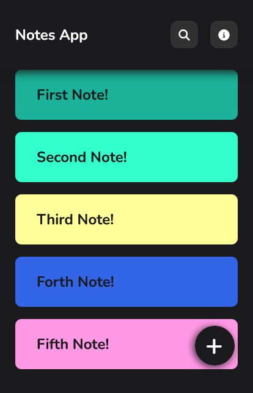
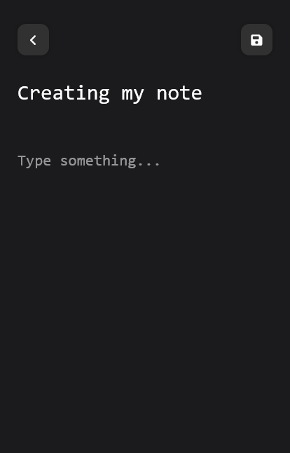
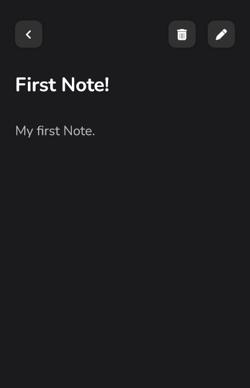

# Notes App Page.

This is just a personal study project made for mobile.

## Table of contents

- [Overview](#overview)
  - [Screenshot](#screenshot)
  - [Built with](#built-with)
  - [Author](#author)

## Overview

### Pages

Git Pages - [Project](https://gabrielfteles.github.io/NotesApp/)

### The challenge

Users should be able to:

- Create notes with title and description.
- Preview notes.
- Delete notes.
- Edit notes.

### Screenshot

 

### Creating Note

 

### Previewing Note

## Built with

Technologies

- HTML
- CSS
- JavaScript

Other

- Semantic HTML5 markup
- CSS custom properties
- Flexbox

## Author

- Linkedin - [Gabriel Teles](https://www.linkedin.com/in/gabriel-teles-b28709234/)
- Twitter - [@ToVivendoErrado](https://www.twitter.com/ToVivendoErrado)
